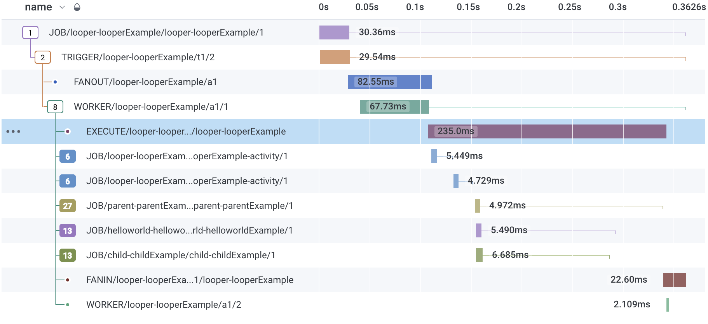
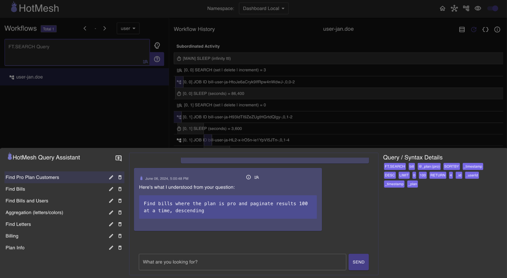

# HotMesh


<span style="font-size:1.05em">**HotMesh**</span> transforms <span style="font-size:1.05em">**Redis**</span> into indispensable <span style="font-size:1.05em">**Middleware**</span>. Effortlessly connect <span style="font-size:1.05em">**everything**</span>.

## Install
```sh
npm install @hotmeshio/hotmesh
```
You have a Redis instance? Good. You're ready to go.

## MeshCall
The **MeshCall** module connects any function to the mesh. Calls are brokered via Redis Streams, reducing the overhead of HTTP without backpressure risk.

<details style="padding: .5em">
  <summary style="font-size:1.25em;">Call a function in another service</summary>

  ### Overview
  Make blazing fast interservice calls that return in milliseconds without the overhead of HTTP.

1. Use `MeshCall.connect` to link your function. Choose a `topic` to identify it and a `namespace` to group related functions. Replace `callback` with your function logic. Return the response; the `data` field is your payload.

    ```javascript
    //myFunctionWrapper.ts
    import { MeshCall } from '@hotmeshio/hotmesh';
    import * as Redis from 'redis';

    export const connectMyFunction = () => {
      MeshCall.connect({
        namespace: 'sandbox',
        topic: 'my.serviceb.function',
        redis: {
          class: Redis,
          options: { url: 'redis://:key_admin@localhost:6379' }
        },
        callback: async (input: StreamData) => {
          //return the response; data field is your payload
          return {
            metadata: { ...input.metadata },
            data: { youSent: input.data.IamSending }
          };
        },
      });
    };
      ```

2. Call `connectMyFunction` once at server startup to connect your function to the mesh.

    ```javascript
    //server.ts
    import { connectMyFunction } from './myFunctionWrapper';
    
    connectMyFunction();
    ```

3. Call your function from anywhere on the network (or even the same service). Send any payload as long as it's JSON serializable.

    ```javascript
    import { MeshCall } from '@hotmeshio/hotmesh';
    import * as Redis from 'redis';

    const result = await MeshCall.exec({
      namespace: 'sandbox',
      topic: 'my.serviceb.function',
      payload: { IamSending: 'something' },
      redis: {
        class: Redis,
        options: { url: 'redis://:key_admin@localhost:6379' }
      },
    }); //returns `{ youSent: 'something'}`
    ```
</details>

<details style="padding: .5em">
  <summary style="font-size:1.25em;">Call and <b>cache</b> a function</summary>

  ### Overview
  Redis is great for unburdening stressed services. This solution builds upon the previous example, caching the response. The linked function will only be re/called when the cached result expires. Everything remains the same, except the caller which specifies a `ttl`.

1. Make the call from another service (or even the same service). Include a `ttl` to cache the result for the specified duration.

    ```javascript
    import { MeshCall } from '@hotmeshio/hotmesh';
    import * as Redis from 'redis';

    const result = await MeshCall.exec({
      namespace: 'sandbox',
      topic: 'my.serviceb.function',
      payload: { IamSending: 'something' },
      redis: {
        class: Redis,
        options: { url: 'redis://:key_admin@localhost:6379' }
      },
      options: { ttl: '15 minutes' },
    }); //returns `{ youSent: 'something'}`
    ```
</details>

<details style="padding: .5em">
  <summary style="font-size:1.25em;">Run a cron job</summary>

  ### Overview
  This example demonstrates an *idempotent* cron that runs every day. Optionally set `maxCycles` or `maxDuration` to limit the number of cycles. Use your chosen `id` to cancel the cron job.

1. Define the cron function.
    ```javascript
    //cron.ts
    import { MeshCall } from '@hotmeshio/hotmesh';
    import * as Redis from 'redis';

    export const runMyCron = () => {
      MeshCall.cron({
        namespace: 'sandbox',
        topic: 'my.cron.function',
        redis: {
          class: Redis,
          options: { url: 'redis://:key_admin@localhost:6379' }
        },
        callback: async () => {
          //run your cron function
        },
        options: {
          id: 'myDailyCron',
          interval: '1 day'
        }
      });
    };
    ```

2. Call `runMyCron` once at server startup or call as needed.
    ```javascript
    //server.ts
    import { runMyCron } from './cron';

    runMyCron();
    ```
</details>

<details style="padding: .5em">
  <summary style="font-size:1.25em;">Interrupt a cron job</summary>
</details>

## MeshFlow
The **MeshFlow** module is designed as a drop-in replacement for Temporal.io. If you need to orchestrate your functions as durable workflows, MeshFlow provides a familiar set of tools with *in-memory execution speed*.

<details style="padding: .5em">
  <summary style="font-size:1.25em;">Orchestrate unpredictable activities</summary>

### Overview
When an endpoint is unpredictable, use `proxyActivities`; HotMesh will retry as necessary until it succeeds. This example demonstrates a simple workflow that greets a user in both English and Spanish. But both only succeed 50% of the time.

1. Start by defining **activities**. Note how each throws an error 50% of the time.

    ```javascript
    //activities.ts
    export async function greet(name: string): Promise<string> {
      if (Math.random() > 0.5) throw new Error('Random error');
      return `Hello, ${name}!`;
    }

    export async function saludar(nombre: string): Promise<string> {
      if (Math.random() > 0.5) throw new Error('Random error');
      return `¡Hola, ${nombre}!`;
    }
    ```

2. Define the **workflow** logic. Include conditional branching, loops, etc to control activity execution. It's vanilla code written in your own coding style. The only requirement is to use `proxyActivities`, ensuring your activities are executed with HotMesh's durability guarantee.

    ```javascript
    //workflows.ts
    import { MeshFlow } from '@hotmeshio/hotmesh';
    import * as activities from './activities';

    const { greet, saludar } = MeshFlow.workflow
      .proxyActivities<typeof activities>({
        activities
      });

    export async function example(name: string): Promise<[string, string]> {
      return Promise.all([
        greet(name),
        saludar(name)
      ]);
    }
    ```

3. Instance a HotMesh **client** to invoke the workflow.

    ```javascript
    //client.ts
    import { MeshFlow, HotMesh } from '@hotmeshio/hotmesh';
    import Redis from 'ioredis';

    async function run(): Promise<string> {
      const client = new MeshFlow.Client({
        connection: {
          class: Redis,
          options: { host: 'localhost', port: 6379 }
        }
      });

      const handle = await client.workflow.start<[string,string]>({
        args: ['HotMesh'],
        taskQueue: 'default',
        workflowName: 'example',
        workflowId: HotMesh.guid()
      });

      return await handle.result();
      //returns ['Hello HotMesh', '¡Hola, HotMesh!']
    }
    ```

4. Finally, create a **worker** and link the workflow function. Workers listen for tasks on their assigned Redis stream and invoke the workflow function each time they receive an event.

    ```javascript
    //worker.ts
    import { MeshFlow } from '@hotmeshio/hotmesh';
    import Redis from 'ioredis';
    import * as workflows from './workflows';

    async function run() {
      const worker = await MeshFlow.Worker.create({
        connection: {
          class: Redis,
          options: { host: 'localhost', port: 6379 },
        },
        taskQueue: 'default',
        workflow: workflows.example,
      });

      await worker.run();
    }
    ```
</details>

<details style="padding: .5em">
  <summary style="font-size:1.25em;">Pause and wait for a signal</summary>
</details>

<details style="padding: .5em">
  <summary style="font-size:1.25em;">Wait for multiple signals (collation)</summary>
</details>

<details style="padding: .5em">
  <summary style="font-size:1.25em;">Create a recurring, cyclical workflow</summary>
</details>

## MeshData
The **MeshData** service extends the MeshFlow service, combining data record concepts and transactional workflow principles into a single "Operational Data Layer" (ODL). Deployments with the Redis FT.SEARCH module enabled can use MeshData to merge OLTP and OLAP operations into a single operational data layer.

<details style="padding: .5em">
  <summary style="font-size:1.25em;">Create an indexed, searchable record</summary>
</details>

<details style="padding: .5em">
  <summary style="font-size:1.25em;">Attach recurring, cyclical subflows to a record</summary>
</details>

<details style="padding: .5em">
  <summary style="font-size:1.25em;">Transactionally update a record</summary>
</details>

<details style="padding: .5em">
  <summary style="font-size:1.25em;">Run real-time aggregation Statistics</summary>
</details>

## Visualize | OpenTelemetry
Add your Honeycomb credentials to `.env`, and view the full *OpenTelemetry* execution tree organized as a DAG.



## Visualize | RedisInsight
View commands, streams, data, etc using RedisInsight.


## Visualize | HotMesh Dashboard
The HotMesh dashboard provides a visual representation of the network, including the number of engines, workers, and workflows. It also provides a real-time view of the network's health and performance, linking to the OpenTelemetry dashboard for more detailed information.

An LLM is also included to simplify querying and analyzing workflow data for those deployments that include the Redis `FT.SEARCH` module.



## Understanding HotMesh
HotMesh inverts the relationship to Redis: those functions that once used Redis as a cache, are instead *cached and governed* by Redis. Consider the following. It's a typical microservices network, with a tangled mess of services and functions. There's important business logic in there (functions *A*, *B* and *C* are critical), but it's hard to find and access.


HotMesh creates an *ad hoc*, Redis-backed network of functions and organizes them into a unified service mesh. *Any service with access to Redis can join in the network, bypassing the legacy clutter.*

#### Workflow Extensions
Externalizing state fundamentally changes the execution profile for your functions, allowing you to design long-running, durable workflows. The `MeshFlow` base class (shown in the examples above) provides additional methods for solving the most common state management challenges.

 - `waitFor` Pause your function using your chosen signal key, and only awaken when the signal is received from the outide. Use a standard `Promise` to collate and cache the signals and only awaken your function once all signals have arrived.
    ```javascript
    const { waitFor } = MeshFlow.workflow;
    const [a, b] = await Promise.all([
      waitFor<{payload: string}>('sig1'),
      waitFor<number>('sig2')
    ]);
    ```
 - `signal` Send a signal (and payload) to a paused function awaiting the signal. Signals may also be sent from the outside to awaken a paused function.
    ```javascript
    await MeshFlow.workflow.signal('sig1', {payload: 'hi!'});
    ```
 - `hook` Redis governance converts your functions into 're-entrant processes'. Optionally use the *hook* method to spawn parallel execution threads to augment a running workflow.
    ```javascript
    await MeshFlow.workflow.hook({
      workflowName: 'newsletter',
      taskQueue: 'default',
      args: []
    });
    ```
 - `sleepFor` Pause function execution for a ridiculous amount of time (months, years, etc). There's no risk of information loss, as Redis governs function state. When your function awakens, function state is efficiently (and automatically) restored and your function will resume right where it left off.
    ```javascript
    await MeshFlow.workflow.sleepFor('1 month');
    ```
 - `random` Generate a deterministic random number that can be used in a reentrant process workflow (replaces `Math.random()`).
    ```javascript
    const random = await MeshFlow.workflow.random();
    ```
 - `execChild` Call another durable function and await the response. *Design sophisticated, multi-process solutions by leveraging this command.*
    ```javascript
    const jobResponse = await MeshFlow.workflow.execChild({
      workflowName: 'newsletter',
      taskQueue: 'default',
      args: [{ id, user_id, etc }],
    });
    ```
 - `startChild` Call another durable function, but do not await the response.
    ```javascript
    const jobId = await MeshFlow.workflow.startChild({
      workflowName: 'newsletter',
      taskQueue: 'default',
      args: [{ id, user_id, etc }],
    });
    ```
 - `getContext` Get the current workflow context (workflowId, replay history, replay index, etc).
    ```javascript
    const context = await MeshFlow.workflow.getContext();
    ```
 - `search` Instance a search session
    ```javascript
    const search = await MeshFlow.workflow.search();
    ```
    - `set` Set one or more name/value pairs
      ```javascript
      await search.set('name1', 'value1', 'name2', 'value2');
      ```
    - `get` Get a single value by name
      ```javascript
      const value = await search.get('name');
      ```
    - `mget` Get multiple values by name
      ```javascript
      const [val1, val2] = await search.mget('name1', 'name2');
      ```
    - `del` Delete one or more entries by name and return the number deleted
      ```javascript
      const count = await search.del('name1', 'name2');
      ```
    - `incr` Increment (or decrement) a number
      ```javascript
      const value = await search.incr('name', 12);
      ```
    - `mult` Multiply a number
      ```javascript
      const value = await search.mult('name', 12);
      ```

Refer to the [hotmeshio/samples-javascript](https://github.com/hotmeshio/samples-javascript) repo for usage examples.

### Design | Advanced
The *Pluck* and *MeshFlow* modules are the easiest way to use HotMesh. But if you need full control over your function lifecycles (including high-volume, high-speed use cases), you can use HotMesh's underlying YAML models to optimize your durable workflows. The following model depicts a sequence of activities orchestrated by HotMesh. Any function you associate with a `topic` in your YAML definition is guaranteed to be durable.

```yaml
app:
  id: sandbox
  version: '1'
  graphs:
    - subscribes: sandbox.work.do
      publishes: sandbox.work.done

      activities:
        gateway:
          type: trigger
        servicec:
          type: worker
          topic: sandbox.work.do.servicec
        serviced:
          type: worker
          topic: sandbox.work.do.serviced
        sforcecloud:
          type: worker
          topic: sandbox.work.do.sforcecloud

      transitions:
        gateway:
          - to: servicec
        servicec:
          - to: serviced
        serviced:
          - to: sforcecloud
```

### Initialize
Provide your chosen Redis instance and configuration options to start a HotMesh Client. *HotMesh supports both `ioredis` and `redis` clients interchangeably.*

```javascript
import { HotMesh } from '@hotmeshio/hotmesh';
import Redis from 'ioredis'; //OR `import * as Redis from 'redis';`

const hotMesh = await HotMesh.init({
  appId: 'sandbox',
  engine: {
    redis: {
      class: Redis,
      options: { host, port, password, db } //per your chosen Redis client
    }
  }
});
```

A HotMesh Client can be used to trigger worfkows and subscribe to results.

### Trigger a Workflow
Call `pub` to initiate a workflow. This function returns a job ID that allows you to monitor the progress of the workflow.

```javascript
const topic = 'sandbox.work.do';
const payload = { };
const jobId = await hotMesh.pub(topic, payload);
```

### Subscribe to Events
Call `psub` (patterned subscription) to subscribe to all workflow results for a given topic.

```javascript
await hotMesh.psub('sandbox.work.done.*', (topic, jobOutput) => {
  // use jobOutput.data
});
```

### Trigger and Wait
Call `pubsub` to start a workflow and *wait for the response*. HotMesh establishes a one-time subscription and delivers the job result once the workflow concludes.

```javascript
const jobOutput = await hotMesh.pubsub(topic, payload);
```

>The `pubsub` method is a convenience function that merges pub and sub into a single call. Opt for HotMesh's queue-driven engine over fragile HTTP requests to develop resilient solutions.

### Link Worker Functions
Link worker functions to a topic of your choice. When a workflow activity in the YAML definition with a corresponding topic runs, HotMesh will invoke your function, retrying as configured until it succeeds.

```javascript
import { HotMesh } from '@hotmeshio/hotmesh';
import Redis from 'ioredis';

const hotMesh = await HotMesh.init({
  appId: 'sandbox',
  workers: [
    { 
      topic: 'sandbox.work.do.servicec',
      redis: {
        class: Redis,
        options: { host, port, password, db }
      }
      callback: async (input: StreamData) => {
        return {
          metadata: { ...input.metadata },
          data: { }
        };
      }
    }
  ]
};
```

### Observability
Workflows and activities are run according to the rules you define, offering [Graph-Oriented](https://github.com/hotmeshio/sdk-typescript/tree/main/docs/system_lifecycle.md#telemetry) telemetry insights into your legacy function executions.

## FAQ
Refer to the [FAQ](https://github.com/hotmeshio/sdk-typescript/tree/main/docs/faq.md) for terminology, definitions, and an exploration of how HotMesh facilitates orchestration use cases.

## Quick Start
Refer to the [Quick Start](https://github.com/hotmeshio/sdk-typescript/tree/main/docs/quickstart.md) for sample YAML workflows you can copy, paste, and modify to get started.

## Developer Guide
For more details on the complete development process, including information about schemas, APIs, and deployment, consult the [Developer Guide](https://github.com/hotmeshio/sdk-typescript/tree/main/docs/developer_guide.md).

## Model Driven Development
[Model Driven Development](https://github.com/hotmeshio/sdk-typescript/tree/main/docs/model_driven_development.md) is an established strategy for managing process-oriented tasks. Check out this guide to understand its foundational principles.

## Data Mapping
Exchanging data between activities is central to HotMesh. For detailed information on supported functions and the functional mapping syntax (@pipes), see the [Data Mapping Overview](https://github.com/hotmeshio/sdk-typescript/tree/main/docs/data_mapping.md).

## Composition
While the simplest graphs are linear, detailing a consistent sequence of non-cyclical activities, graphs can be layered to represent intricate business scenarios. Some can even be designed to accommodate long-lasting workflows that span months. For more details, check out the [Composable Workflow Guide](https://github.com/hotmeshio/sdk-typescript/tree/main/docs/composable_workflow.md).

## System Lifecycle
Gain insight into HotMesh's monitoring, exception handling, and alarm configurations via the [System Lifecycle Guide](https://github.com/hotmeshio/sdk-typescript/tree/main/docs/system_lifecycle.md).

## Distributed Orchestration | System Overview
HotMesh is a distributed orchestration engine. Refer to the [Distributed Orchestration Guide](https://github.com/hotmeshio/sdk-typescript/tree/main/docs/distributed_orchestration.md) for a high-level overview of the approach.

## Distributed Orchestration | System Design
HotMesh is more than Redis and TypeScript. The theory that underlies the architecture is applicable to any number of data storage and streaming backends: [A Message-Oriented Approach to Decentralized Process Orchestration](https://zenodo.org/records/12168558).
