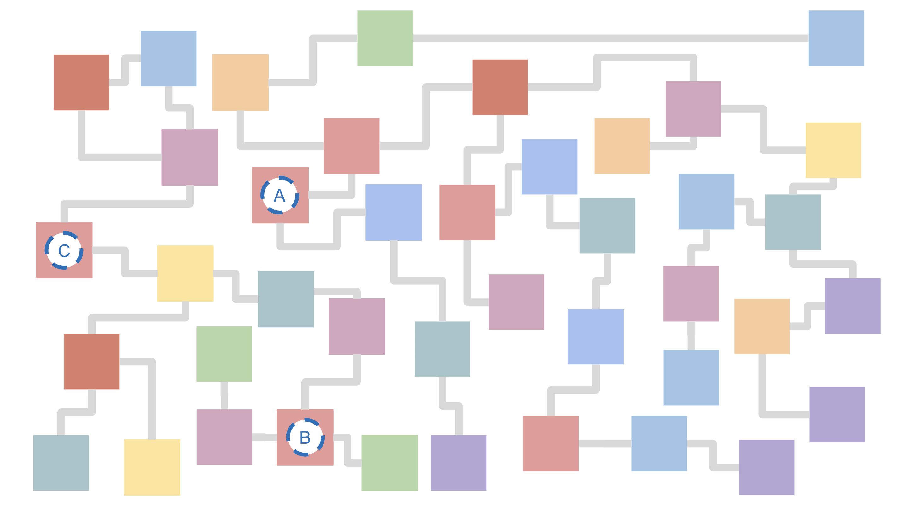
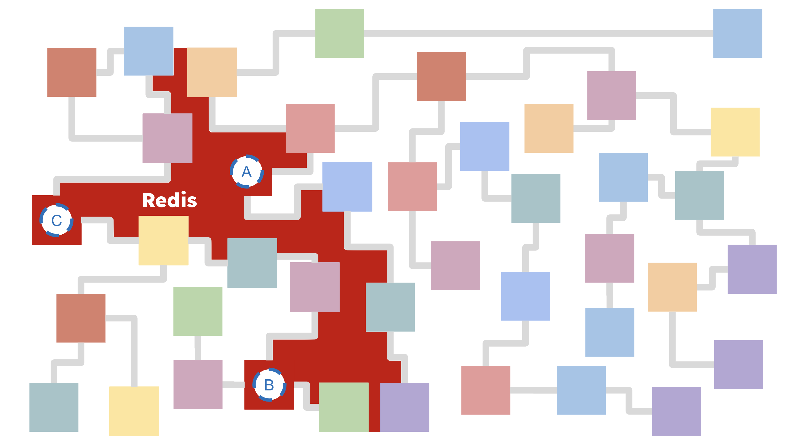
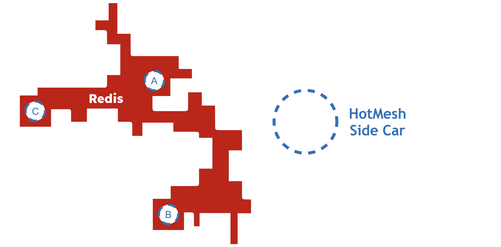

# HotMesh Alpha Release

## Motivation  
I hold a patent in [Ajax and Single Page Applications](https://patents.google.com/patent/US8136109) and consider it a defining aspect of my early engineering career. I still dabble in front-ends and APIs, but the more time I've spent in cloud technologies (microservices in particular), the more I've come to perseverate on just how difficult it is to design distributed applications.

It borders on unacceptable now two decades in just how unnecessarily complex it is to reason about multi-service applications in the cloud. Anyone can deploy that initial "Hello World" cloud application using Postgres and Node. But the journey from that first deployment to something that scales across billions of events requires its own genius. How does one reason about a code base that solves both initial and eventual states? The cloud makes this easy, right? right?

But every time I sift through a company's legacy code base, it feels like most of the IP is buried in a tangle of custom, home-grown workflows. 

There's real value in there. Functions A, B, and C represent important company IP. But it's the service-to-service interactions (retries, scaling, assymetry, back-pressure, load-balancing, dlqs, rollbacks, etc) that feels unmanageable.

The promise (at least what was pitched two decades ago) is that the cloud was about to become that "big appliance in the sky". I had hoped the cloud would one day feel like a singular, unified system. And I know I'm not alone as others have voiced a desire to solve this same issue through other means, with monolith architectures getting their day in the sun.

## Approach  
I strongly prefer *distributed* architectures and enjoy modifying traditional systems using this lens. It's what led me to stumble upon the Ajax pattern, even though the architectural standard at the time was to push HTML content using server-side engines like JSP, ASP, Cold Fusion, etc.

In early 2023 I revisited an orchestration engine I had built years ago. But I took another pass at it using the Command Query Response Segregation (CQRS) pattern. It's central to event-driven systems like Kafka and is a foundational principle around their scale and reslience. And it's most definitely a 'pull-based' approach (that's what the 'Query' in CQRS stands for).

In this scenario, the producers merely inscribe their completion events onto the log. Concurrently, the consumers read from this log. This separation is of key significance: the progression of the workflow is driven not by the producer prompting the next task directly, but by the consumer's act of reading from the log. Note in the following how the Engine and Worker are decoupled from each other (and from the outside callers as well):

This simple mechanism of reading from one stream and writing to another is the basis for the entire system and how complex workflows are achieved. Every complex workflow is simply a series of singular activities implicitly stitched together by writing to streams in a sequence.

## Reimagining Redis
As cluttered as the legacy information flow might be, there's a common thread: **Redis**. If the legacy functions can access Redis, then Redis can access the legacy functions.

From this vantage point, the legacy network remains chaotic. But now we have a strategy to simplify things and organize the functions as activities in a straight-forward business process.

## Apples-to-Apples  
If you're familiar with Temporal, then you're familiar with HotMesh. We align on pretty much every principle, including the need for a fleet of servers to provide *durable process execution*. However, in the case of HotMesh, the fleet of servers is minaturized and distributed to the fringes just-in-time (i.e., the "Ajax/SPA" architecture).

*It's serverless Temporal delivered just-in-time, anywhere you have a connection to Redis.*

Temporal's TypeScript SDK was an inspiration for HotMesh's TypeScript SDK. Their well-designed approach allows developers to focus on code rather than learning workflow-specific terminology.

In the initial, alpha release, I've included a module named `Durable` that emulates Temporal's standard `worker`, `client`, `activities`, and `workflows` files as well as `proxyActivity` and `executeChild` methods, as these are crucial for validating the capabilities of HotMesh as a *drop-in serverless replacement* for Temporal.

I've conducted performance tests comparing Temporal Cloud to Redis Enterprise Cloud, and my hypothesis is that a serverless, distributed architecture offers various advantages, including speed and cost. Import HotMesh instead of Temporal for a quick side-by-side comparison, using your own deployments.

## Concluding Thoughts  
The industry's shift from server-based technologies like JSP, ASP, and Cold Fusion to client-side solutions like Ajax serves as a precedent for this kind of transition. Ajax was revolutionary not because it introduced new technologies but because it simplified and distributed existing capabilities, leading to economic efficiencies. I believe HotMesh has the potential for a similar impact in the field of durable process orchestration.
