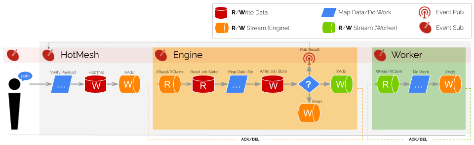

# A Distributed Engine Architecture for Operationalizing Data at Scale
There are a set of architectural first-principles that undergird how state and process must be separated to realize the full performance benefit of this scheme. They are inconsequential individually, but when applied as a set, they enable distributed orchestration at scale, without contention, timeout and similar challenges. Orchestration is an emergent property of the data journaling process--a byproduct of saving state to Redis. It is produced without a central governing body, which is why HotMesh's scale is limited only by Redis' ability to journal state.

- [Foundation](#foundation)
  * [Central Server](#central-server)
  * [Distributed Clients](#distributed-clients)
- [Design Principles](#design-principles)
  * [Sequence Activities with a DAG](#sequence-activities-with-a-dag)
  * [Limit Execution Scope to ECA](#limit-execution-scope-to-eca)
  * [Duplex Activity Execution Calls](#duplex-activity-execution-calls)
  * [Mediate Duplexed Calls With EAI](#mediate-duplexed-calls-with-eai)
  * [Leverage CQRS for Self-Perpetuation](#leverage-cqrs-for-self-perpetuation)
  * [Efficiently Track Shared Activity State](#efficiently-track-shared-activity-state)
  * [Efficiently Track Shared Job State](#efficiently-track-shared-job-state)
- [Scalability Benefits](#scalability-benefits)
  * [Fan-out Scalability](#fan-out-scalability)
  * [Fan-in Scalability](#fan-in-scalability)
  * [Data Scaling Simplicity](#data-scaling-simplicity)
  * [Engine Scaling Simplicity](#engine-scaling-simplicity)
- [Comparison to Other Architectures](#comparison-to-other-architectures)

## Foundation
The [Ajax/Single Page Application architecture](https://patents.google.com/patent/US8136109) efficiently solves distributed state at scale by cleanly separating data and processing instructions into two distinct channels. HotMesh is modeled after this architecural pattern, with a reference implementation using Redis as the *Server* and the [HotMesh NPM package](https://www.npmjs.com/package/@hotmeshio/hotmesh) as the *Client(s)*. 

### Central Server
In this design, a central server (or a server cluster with a central router) hosts the execution instructions, providing them to each connected client. Importantly, the home server *never* executes the processing instructions it hosts but does serve as the single source of truth for storing the result of each execution.


### Distributed Clients
Distributed clients register to receive events by subscribing to topics and streams on the central server. As each event is received, each client processes and executes the event using the processing instructions provided by the central server. Clients may cache the processing instructions to streamline execution, but they may not cache the result of an execution and must instead journal state back to the central server.

## Design Principles
The following principles form the basis for the Distributed Client (Engine) design.

### Sequence Activities with a DAG
HotMesh uses a Directed Acyclic Graph (DAG) variant known as rooted tree to model the activity flow. This was chosen due to its strict enforcement of a single entry point while still allowing for parallel activities. Sequence and parallelization are both critical to building an efficient execution engine, and the DAG is the most efficient representation that achieves this.


### Limit Execution Scope to ECA
Event-driven architectures are known for their high performance and ability to handle variable and burst workloads efficiently. In this pattern, publishers send messages without knowing which subscribers, if any, are receiving them. The essential computational unit for event-driven architectures is the Event->Condition->Action (ECA) pattern. The Distributed Event Bus limits its process scope to this single unit of execution before terminating the process.


### Duplex Activity Execution Calls
The conventional ECA (Event-Condition-Action) model treats the *Action* as a single atomic operation, primarily because it does not inherently support state retention. Therefore, in order to handle long-running business processes and ensure uninterrupted data exchange, it becomes necessary to divide the *Action* into two distinct components. This division forms the basis for a full-duplex system, where each activity comprises two legs, "beginning" and "conclusion," bridged by an asynchronous wait state. Importantly, this transformation adheres to the fundamental principles of ECA by giving rise to two distinct ECA sequences for initiating and concluding the activity.


### Mediate Duplexed Calls with EAI
The transformation of isolated event-driven operations, or ECA units, into cohesive business processes calls for an intermediary abstraction layer to direct and synchronize these individual units, namely, [Enterprise Application Integration](https://en.wikipedia.org/wiki/Enterprise_application_integration) (EAI).


EAI serves as a principal scheme for unification, amalgamating separate ECA units into a comprehensive network of business processes. It ensures that the transmitted data complies with predetermined schemas and data types, allowing the system to convert data from one format to another as it flows from activity to activity.

### Leverage CQRS for Self-Perpetuation
In the orchestration of business processes, *operational continuity* emerges as a critical aspect. This is where Command Query Responsibility Segregation (CQRS) has a pivotal role to play by decoupling the read (query) and write (command) operations in a system. Consider a sequence of tasks: `A`, `B`, and `C`. In a conventional execution flow, the completion of `A` directly initiates `B`, which in turn sets off `C`:

```
A --> B --> C
```

This presents a chain of dependencies where the execution of one task is directly bound to its predecessor, making the system vulnerable to bottlenecks and cascading failures. With CQRS, this is addressed by linking the *logged* completion of `A` to the initiation of `B` and `B`'s *logging* to the initiation of `C`, etc:

```
A --> log[A completed] --> B --> log[B completed] --> C
```

In this scenario, the producers merely inscribe their completion events onto the log. Concurrently, the consumers read from this log. This separation is of key significance: the progression of the workflow is driven not by the producer prompting the next task directly, but by the consumer's act of reading from the log. Note in the following how the Engine and Worker are decoupled from each other (and from the outside callers as well):



This simple mechanism of reading from one stream and writing to another is the basis for the entire system and how complex workflows are achieved. Every complex workflow is simply a series of singular activities implicitly stitched together by writing to streams in a sequence.

### Efficiently Track Shared Activity State
Activity state is managed using a 15-digit semaphore initialized by the parent activity (the preceding activity) in the DAG. The value value is saved as `999000000000000`, and only then is the instruction sent to the stream to run the target activity.

The first three digits monitor the lifecycle statuses of Legs 1 and 2, while the remaining 12 digits offer 1 million distinct dimensional threads for activity expansion. *Dimensional Threads* isolate and track those activities in the workflow that run in a *cycle*. They ensure that no naming collisions occur, even if the same activity is run multiple times.

```
  999000000000000
  ^-------------- Leg1 Entry Status
    ^------------- Leg1 Exit Status
      ^^^^^^------ Leg2 Dimensional Thread Entry Count
            ^^^^^^ Leg2 Dimensional Thread Exit Count
    ^------------ Leg2 Exit Status
```

>Streams are used when executing an activity (such as transitioning to a child activity) as they guarantee that the child activity will be fully created and initialized before the request is marked for deletion. Even if the system has a catastrophic failure, the chain of custody can be guaranteed through the use of streams when the system comes online.

### Efficiently Track Shared Job State
Efficiently tracking job state is critical to asynchronous workflow systems and is accomplished through a semaphore that will count down to `0` once all activities have completed for the flow. 

The semaphore is updated via increment/decrement calls to the central server. The value sent to the semaphore will always be the length of the adjacent activity list (the number of child activity nodes that should execute) minus 1.

If the adjacency list has members, each child activity in the adjacency list will be journaled to its designated stream and the pattern will repeat. 

If there are no adjacent children and the incremented/decremented status returned from the server is `0`, then the job is complete (this activity was the last of all activities to complete).

The act of the caller saving individual state triggers a server response with full job semaphore state.

## Scalability Benefits
### Fan-out Scalability
HotMesh supports scale out by distributing processing instructions to a growing number of clients. (*This is an advantage of event-driven architectures and isn't unique to HotMesh.*) As new clients connect, the home server delivers the instructions, enabling each client to increase the throughput.

### Fan-in Scalability
While fan-in scenarios are typically resource-intensive, HotMesh efficiently handles them through a combination of CQRS and shared collation state. *There is no **computation** cost associated with tracking deeply nested, compositional state within your workflows. Implementations are only limited by the **memory** constraints of the central data store (e.g, Redis).*

### Data Scaling Simplicity
Since HotMesh focuses on exchanging pure data, scaling the system becomes more straightforward. The primary concern is scaling the data layer, without having to consider the intricacies of the client layer. This separation of concerns simplifies maintainability and ensures that the system can efficiently grow using standard cloud data scaling solutions.

### Engine Scaling Simplicity
An essential aspect of the distributed engine architecture, is that each connected client is responsible for executing their processing instructions independently. Scaling the distributed engine is essentially free, as clients handle the processing and manipulation. The *processing instructions* serve as the source code for the application and are distributed to each connected client on-demand. This approach also allows the system to simultaneously hot-deploy updates to all connected clients without interruption.

## Comparison to Other Architectures
HotMesh delivers durable microservice orchestration like [Temporal](https://temporal.io). But HotMesh is fundamentally different from Temporal in that the engine is an emergent property of the system design. *It is an operational outcome of the data journaling process.* HotMesh can run millions of simultaneous workflows using a single Redis instance at Redis's unmatched speed and scale.
