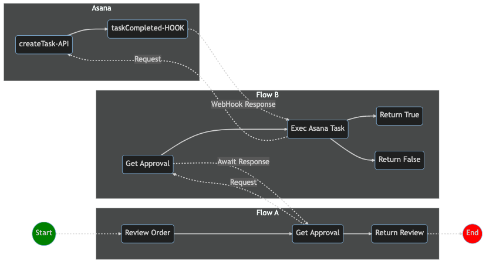
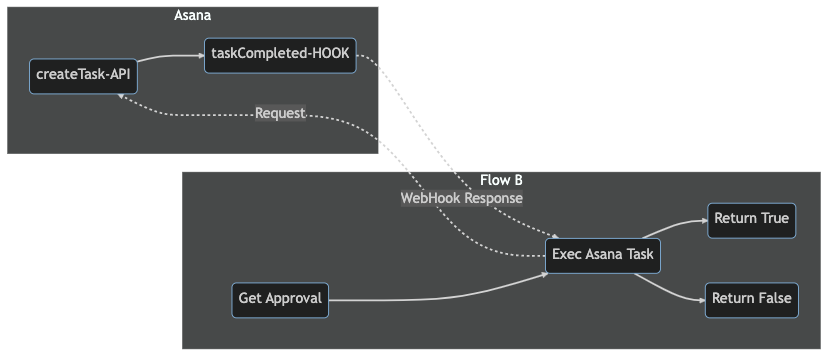
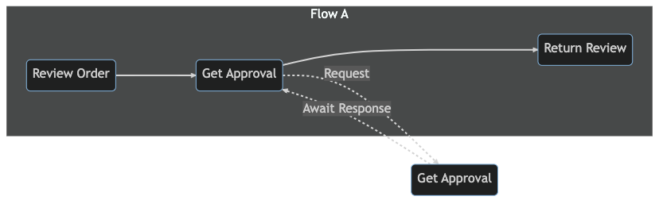

# Composable Workflow
HotMesh workflows are modeled as directed acyclic graphs (*rooted trees*). This structure allows for efficient scheduling and execution of tasks and is used in parallel and distributed computing systems.

<small>**HOTMESH WORKFLOW DEFINITION FILE**</small>

```yaml
subscribes: approval.requested
publishes: approval.responded

activities:
  a1:
    title: Request Approval
    type: trigger
  a2:
    title: Create Asana Task
    type: worker
    topic: asana.1.createTask
  a3:
    title: Save Task ID
    type: job

transitions:
  a1:
    - to: a2
  a2:
    - to: a3
```

## Composition
The simplest graphs are linear, defining a predictable sequence of non cyclical activities. But graphs can be composed to model complex business scenarios and can even be designed to support long-running workflows lasting weeks or months. 

In general, there are two ways to incorporate long-running activities into a HotMesh workflow: *hook* and *await*.

### Hook
The `hook` pattern is used when coordinating **external**, long-running tasks. The term, `hook`, is shorthand for `WebHook` as WebHooks are commonly used to drive this behavior, where the system pauses until an external event signals it to resume. This is common with approval flows where an approval task gets created, but a WebHook is used to signal when it completes.

### Await
The `await` pattern is **internally** focused and is used when an activity in one flow invokes another flow. The engine will pause the caller activity until a response is received.


<small>*A Multi-Flow Process Showcasing Both `Hook` and `Await`*</small>

### Example 1 | Asana WebHook
Flow B includes a *compositional* activity, namely, **Exec Asana Task** (`a2`). This activity makes a call to Asana to create a task and then sleeps. 



Given the `conditions` for activity `a2` (as defined by its `hooks` configuration) activity, `a2`, will only awaken if Asana sends a WebHook event with a matching `task_id` and a `status` of *completed*. For example:

```yaml
# ./myapp/2/flowb/1.yaml

subscribes: order.approve
publishes: order.approved

activities:
  a1:
    title: Get Approval
    type: trigger
    output:
      schema:
        $ref: ./schemas.yaml#/a1/output
    job:
      schema:
        $ref: ./schemas.yaml#/a1/job
    errors:
      schema:
        $ref: ./schemas.yaml#/a1/errors
    stats:
      id: "{$self.output.data.id}"
      key: "{$self.output.data.object_type}"
      measures:
        - measure: count
          target: "{$self.output.data.region}"
        - measure: count
          target: "{$self.output.data.division}"
  a2:
    title: Exec Asana Task
    type: worker
    topic: asana.1.createTask
    credentials: asana.1.mycreds
    hook:
      schema:
        $ref: ./schemas.yaml#/a2/hook
    input:
      schema:
        $ref: /specs/asana/1.yml#/TaskRequest
      maps:
        $ref: ./maps.yaml#/a2/input
    output:
      schema:
        $ref: /specs/asana/1.yml#/TaskResponse
    errors:
      schema:
        $ref: /specs/asana/1.yml#/TaskResponseError
  a3:
    title: Return True
    type: job
    input:
      job:
        $ref: './maps.yaml#/a3/job'
  a4:
    title: Return False
    type: job
    job:
      maps:
        $ref: './maps.yaml#/a4/job'

transitions:
  a1:
    - to: a2
  a2:
    - to: a3
      conditions:
        match:
          - expected: true
            actual: "{a2.hook.data.approved}"
    - to: a4
      conditions:
        gate: or
        match:
          - expected: false
            actual: "{a2.hook.data.approved}"
          - expected: false
            actual: 
              "@pipe":
                - ["{a1.output.data.price}", 100]
                - ["{@number.gt}"]

hooks:
  asana.1.taskUpdated:
    - to: a2
      conditions:
        gate: and
        match:
          - expected: "{$self.output.data.task_id}"
            actual: "{$self.hook.data.task_id}"
          - expected: completed
            actual: "{$self.hook.data.status}"
```

### Example 2 | Await
Flow A also includes a *compositional* activity, namely, **Get Approval** (`a6`). This activity calls another flow and awaits the response. This is similar to `hook` type activities except that it is internal (flow-to-flow), so the mechanics are simpler, requiring no special configuration.




```yaml
# ./myapp/2/flowa/1.yaml

subscribes: order.review
publishes: order.reviewed

activities:
  a5:
    title: Review Order
    type: trigger
    output:
      schema:
        $ref: ./schemas.yaml#/a5/output
    job:
      schema:
        $ref: ./schemas.yaml#/a5/job
    errors:
      schema:
        $ref: ./schemas.yaml#/a5/errors
    stats:
      key: "{a1.input.data.object_type}"
      measures:
        - measure: sum
          target: "{a1.input.data.price}"
        - measure: count
          target: "{a1.input.data.price}"
          operator: ">"
          value: 100
        - measure: avg
          target: "{a1.input.data.price}"
  a6:
    title: Get Approval
    type: await
    topic: order.approve
    input:
      schema:
        $ref: ./schemas.yaml#/a6/input
    output:
      schema:
        $ref: ./schemas.yaml#/a6/output
    errors:
      schema:
        $ref: ./schemas.yaml#/a6/errors
  a7:
    title: Return Review
    type: job
    job:
      maps:
        $ref: ./maps.yaml#/a7/job

transitions:
  a5:
    - to: a6
  a6:
    - to: a7
```

## Asana Open API Spec
Here is a snapshot of the official Asana Open API Spec with just the `createTask` operation included. Incorporating external services like Asana into the activity flow is possible using a standard Open API specification as the request/response call flow aligns with HotMesh's input/output semantics. Reference (`$ref`) the Asana schema from your flow to save time documenting input and output fields.

```yaml
openapi: 3.0.3
info:
  title: Asana API
  description: Asana's public OpenAPI spec for creating tasks and handling webhooks.
  version: 1.0.0
servers:
  - url: https://app.asana.com/api/v1

paths:
  /tasks:
    post:
      summary: Create a task
      description: Create a new task in Asana
      operationId: createTask
      requestBody:
        required: true
        content:
          application/json:
            schema:
              $ref: '#/TaskRequest'
      responses:
        200:
          description: Task created successfully
          content:
            application/json:
              schema:
                $ref: '#/TaskResponse'
        default:
          description: Error creating task
          content:
            application/json:
              schema:
                $ref: '#/TaskResponseError'

components:
  schemas:
    TaskRequest:
      type: object
      properties:
        name:
          type: string
          description: The name of the task
        notes:
          type: string
          description: Additional notes for the task
        assignee:
          type: string
          description: The assignee for the task
        due_on:
          type: string
          format: date
          description: The due date for the task
      required:
        - name

    TaskResponse:
      type: object
      properties:
        task_id:
          type: string
          description: The unique identifier for the created task
        data:
          type: object
          properties:
            id:
              type: string
              description: The unique identifier for the created task
            created_at:
              type: string
              format: date-time
              description: The timestamp when the task was created
            modified_at:
              type: string
              format: date-time
              description: The timestamp when the task was last modified
            name:
              type: string
              description: The name of the task
            notes:
              type: string
              description: Additional notes for the task
            assignee:
              type: string
              description: The assignee for the task
            due_on:
              type: string
              format: date
              description: The due date for the task

    TaskResponseError:
      type: object
      properties:
        message:
          type: string
          description: A human-readable error message
        errors:
          type: array
          items:
            type: object
            properties:
              message:
                type: string
                description: A human-readable error message for the specific error
              help:
                type: string
                description: A link to more information about the error
```
