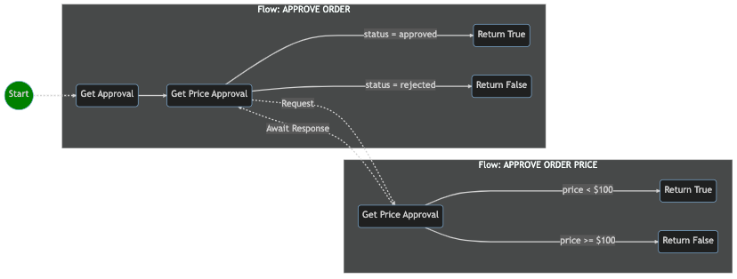

# Developer Guide

This guide defines the recommended development process for deploying a HotMesh solution and will walk you through the essential steps to building maintainable workflows. 

## Table of Contents
1. [Define the Business Process](#define-the-business-process)
2. [Define Activity Graphs](#define-activity-graphs)
3. [Define Conditional Activities](#define-conditional-activities)
4. [Define Activity Topics](#define-activity-topics)
5. [TIP: Organizing for Maintinability](#tip-organizing-files-for-maintainability)
6. [Define Activity Schemas](#define-activity-schemas)
7. [Define Map Rules](#define-map-rules)
8. [Define Statistics](#define-statistics)
9. [Plan](#plan)
10. [Deploy and Activate](#deploy-and-activate)
11. [Pub](#pub)
12. [Sub](#sub)
13. [PubSub](#pubsub)
14. [Get Job Data](#get-job-data)
15. [Get Job Metadata](#get-job-metadata)
16. [Get Aggregate Job Statistics](#get-job-statistics)
17. [Get Job Ids](#get-job-ids)


## Define the Business Process
Refining your current business process, or defining a new one, is a first crucial step in deploying a successful HotMesh solution. A key aspect of this step is identifying the subprocesses that comprise the overall process, as HotMesh is a compositional system.

For purposes of this guide, assume that the business process is as follows, where every time an order gets created, a secondary approval flow is run that checks the price. If the price is less than $100, the order will be approved; if not, it gets rejected.



## Define Activity Graphs
Understanding the underlying business process gathered from step 1 is crucial, as it forms the foundation for defining the activity flow necessary to achieve it. Let's use standard graph notation to describe the activities.

Consider the following graph (in YAML), showcasing four activities for the **Approve Order** business process:

```yaml
activities:
  a1:
    title: Get Approval
    type: trigger
  a2:
    title: Get Price Approval
    type: await
  a3:
    title: Return True
    type: job
  a4:
    title: Return False
    type: job

transitions:
  a1:
    - to: a2
  a2:
    - to: a3
    - to: a4
```

A similar graph showcases the graph for the **Approve Order Price** business process:

```yaml
activities:
  a5:
    title: Get Price Approval
    type: trigger
  a6:
    title: Return True
    type: job
  a7:
    title: Return False
    type: job
transitions:
  a5:
    - to: a6
    - to: a7
```

## Define Conditional Activities
Now, let's review *conditional* activities that only execute when their transition condition is met. It's common in business processes to branch depending upon conditions in the data. Consider the **Approve Order Price** graph with conditions now added to check the `price` field. The conditions ensure that `a5`  only transitions to `a6` if the  price is less than *100*. The inverse condition is applied to the transition from `a5` to `a7`.

```yaml
activities:
  a5:
    title: Get Price Approval
    type: trigger
  a6:
    title: Return True
    type: job
  a7:
    title: Return False
    type: job

transitions:
  a5:
    - to: a6
      conditions:
        match:
          - expected: true
            actual: 
              "@pipe":
                - ["{a5.output.data.price}", 100]
                - ["{@number.lt}"]
    - to: a7
      conditions:
        match:
          - expected: true
            actual: 
              "@pipe":
                - ["{a5.output.data.price}", 100]
                - ["{@number.gte}"]
```

## Define Activity Topics
A well-defined topic space is crucial for the efficient functioning of transactional workflows. With a solid grounding in the business process, you can effectively describe how outside callers invoke workflows and how one workflow invokes another.

*Workflows must subscribe to and publish to exactly one topic.* In this example, the **Approve Order Price** worfklow declares its relevant topics.

```yaml
# ./src/graphs/order.approval.price.requested.yaml
subscribes: order.approval.price.requested
publishes: order.approval.price.responded

activities:
  a5:
    title: Get Price Approval
    type: trigger
  a6:
    title: Return True
    type: job
  a7:
    title: Return False
    type: job

transitions:
  a5:
    - to: a6
      conditions:
        match:
          - expected: true
            actual: 
              "@pipe":
                - ["{a5.output.data.price}", 100]
                - ["{@number.lt}"]
    - to: a7
      conditions:
        match:
          - expected: true
            actual: 
              "@pipe":
                - ["{a5.output.data.price}", 100]
                - ["{@number.gte}"]
```

### TIP: Organizing Files for Maintainability
Proper file organization and directory schemes play a crucial role in maintaining the efficiency and readability of any HotMesh project. *Naming source files according to their subscription topic* ensures easy identification of relevant project files. The recommended directory structure is as follows:
  - `/graphs` | Graphs (workflows) define the sequence of activities and how they transition. 
  - `/schemas` | Schemas define the incoming and outgoing message format for each activity
  - `/maps` | Maps define how upstream activity data is copied and transformed and used as input to downstream activities

```
/src
  |
  ├── /hotmesh.yaml
  |
  ├── /graphs
  │   ├── order.approval.requested.yaml
  │   ├── order.approval.price.requested.yaml
  │   └── ...
  ├── /schemas
  │   ├── order.approval.requested.yaml
  │   ├── order.approval.price.requested.yaml
  │   └── ...
  └── /maps
      ├── order.approval.requested.yaml
      ├── order.approval.price.requested.yaml
      └── ...

```

The file, `hotmesh.yaml`, serves as the app manifest and should include a reference to every flow that should be included when the version is compiled and deployed. Removing a flow from deployment is as easy as removing its reference from the `hotmesh.yaml` file, incrementing the version, and redeploying the app. (*The final deployment step is described [here](#deploy).*)

```yaml
# ./src/hotmesh.yaml
app:
  id: myapp
  version: '1'
  settings:
    some_boolean: true
    some:
      nested:
        string: hello
        integer: 2
  graphs:
    - $ref ./graphs/order.approval.requested.yaml
    - $ref ./graphs/order.approval.price.requested.yaml
```

The following table lists all fields and their configuration. The `settings` field has an open schema. Values can be referenced and used in mapping rules or anywhere data can by mapped. For example, to map the "hello" string in the settings file, reference the path, `{$app.settings.some.nested.string}`.

| Field Name     | Description                                                           |
| -------------- | --------------------------------------------------------------------- |
| app/id         | The unique identifier for your application. Must be URL safe.         |
| app/version    | The version label for your build. Must be URL safe.                   |
| app/settings   | Application-specific settings and static global values.               |
| app/graphs     | A list of workflow graphs to be included in the application.          |

>The app version is a label to mark your build. It can be an integer, semantic version, date (yyyymmdd) or time value (milliseconds).

## Define Activity Schemas
Any Web service with an Open API spec can be referenced (`#ref`) to save time documenting inputs and outputs.  For other activities it is your responsibility to define the schema using the *JSON Schema* standard. For every activity you define for a workflow, consider the INCOMING and OUTGOING messages for which you  will need a schema. 

>The `trigger` activity is unique from other activities in that it doesn't define an **input** schema. Instead, it serves as the front-door for the flow, recieving the event payload and passing to downstream activities. From the perspective of downstream activities, the event payload that triggered the flow is the trigger's **output**. From the perspective of outside callers, it is the flow's **output** (i.e., job data) that matters most as it represents the final output produced by the completed workflow. As you review the remainder of this document, keep this distinction in mind (inside vs outside perspectives) when considering a trigger's "output" vs the flow's "output".

When defining schemas, it's useful to consider the messages being exchanged. Let's start with activity, `a5`, which is the trigger activity for the **Approve Order Price** flow. The purpose of the flow is to essentially approve an order based upon its price. The message exchange is as follows:

**Expected INCOMING event payload for activity a5**
```json
{ "id": "item_123", "price": 55.67, "object_type": "widgetA" }
```

**Expected OUTGOING event payload for activity a5**
```json
{ "id": "item_123", "price": 55.67, "approved": true }
```

Let's define the necessary schemas for activity, `a5`. Schemas can be cumbersome to hand code, but there is sufficient tooling to make things manageable. 

>ChatGPT is an expert at schema design and needs little more than a list of field names: `Create a JSON Schema with 'input' and 'output' objects, each having 'id', 'price', and 'object_type' properties, the 'object_type' property being an enum. 'output' should also have an 'approved' property.`

```yaml
# ./src/schemas/order.approval.price.requested.yaml

input:
  type: object
  properties:
    id:
      type: string
      description: The unique identifier for the object.
    price:
      type: number
      description: The price of the item.
      minimum: 0
    object_type:
      type: string
      description: The type of the order (e.g., widgetA, widgetB)
      enum:
        - widgetA
        - widgetB
output:
  type: object
  properties:
    id:
      type: string
      description: The unique identifier for the object.
    price:
      type: number
      description: The price of the item.
      minimum: 0
    object_type:
      type: string
      description: The type of the order (e.g., widgetA, widgetB)
      enum:
        - widgetA
        - widgetB
        - widget
        - order
    approved:
      type: boolean
      description: Approval status of the object.
```

The workflow must now be updated to reference (`$ref`) the schema for activity, `a5`. Remember, the input schema for the flow is the same as the output schema for the trigger activity. The trigger (`a5`) is merely passing the flow input to downstream activities.

```yaml
# ./src/graphs/order.approval.price.requested.yaml
subscribes: order.approval.price.requested
publishes: order.approval.price.responded

input:
  schema:
    $ref: '../schemas/order.approval.price.requested.yaml#/input'
output:
  schema:
    $ref: '../schemas/order.approval.price.requested.yaml#/output'

activities:
  a5:
    title: Get Price Approval
    type: trigger
  ...
```

## Define Mapping Rules
With the schemas now defined for all activity inputs and outputs, it's now time to define the mapping rules for transferring and transforming the activity data as the workflow executes. In HotMesh, all mapping is driven by the subscriber (the downstream activity). 

Mapping rules can apply static character data (like a fixed string or number) or can apply data produced by upstream activities. This guide does not cover the range of possibe mapping transformations, but it is a purely functional approach that supports the full ECMA standard. Refer to the [Data Mapping Overview](./data_mapping.md) for more information.

For purposes of this guide, assume that we want the **Approve Order Price** workflow to return a message payload looking something like the following:

```json
{ "id": "item_123", "price": 55.67, "approved": true }
```

In order to do this, we'll need to add a *mapping rules file* and reference from our workflow (just like we did for schemas). The mapping file should be saved to the `./maps` subdirectory using the topic naming standard recommended above, where *the file is named using the workflow topic with which it is associated*:

```yaml
# ./src/maps/order.approval.price.requested.yaml
a5:
  job:
    id: "{a5.input.data.id}"
    price: "{a5.input.data.price}"
    object_type: "{a5.input.data.object_type}"
a6:
  job:
    approved: true
a7:
  job:
    approved: false
```

The corresponding workflow should now be updated so that activities `a6` and `a7`reference (`$ref`) the corresponding mapping rules.

```yaml
# ./src/graphs/order.approval.price.requested.yaml
subscribes: order.approval.price.requested
publishes: order.approval.price.responded

activities:
...
  a6:
    title: Return True
    type: job
    job:
      maps:
        $ref: '../maps/order.approval.price.requested.yaml#/a6/job'
  a7:
    title: Return False
    type: job
    job:
      maps:
        $ref: '../maps/order.approval.price.requested.yaml#/a7/job'
...
```

## Define Statistics
As workflows are run at scale, novel patterns and insights start to emerge. The benefit of an event-driven architecture is the flexibility it provides when reacting to statistical events and conditions *as they occur in real time*.

Let's extend the **Approve Order Price** workflow once more and add a `stats` section that will aid in collecting (and reacting to) aggregate statistics.

```yaml
# ./src/graphs/order.approval.price.requested.yaml
subscribes: order.approval.price.requested
publishes: order.approval.price.responded

input:
  schema:
    $ref: '../schemas/order.approval.price.requested.yaml#/input'
output:
  schema:
    $ref: '../schemas/order.approval.price.requested.yaml#/output'

activities:
  a5:
    title: Get Price Approval
    type: trigger
    stats:
      key: "{a5.input.data.object_type}"
      id: "{a5.input.data.id}"
      measures:
        - measure: avg
          target: "{a5.input.data.price}"
        - measure: mdn
          target: "{a5.input.data.price}"
        - measure: count
          target: "{a5.input.data.object_type}"
        - measure: index
          target: "{a5.input.data.object_type}"
  ...
```

The following table lists the key statistics fields and their purpose. Note that the `key` and `id` fields can also use a `@pipe` declaration if a complex transformation is necessary to extract their value from the provided payload.

| Field Name        |  Description                                                       |
| ----------------- | ------------------------------------------------------------------ |
| stats/key         | The key used to group statistics by a specific field/value.        |
| stats/id          | The unique identifier for the data point being measured.           |
| stats/measures    | A list of measures that define the statistical aggregations.       |

### Measure | Avg
The `avg` (average) measure should only be used to target `number` fields. It returns the mean over the specified job aggregation time period for the target field.

### Measure | Sum
The `sum` measure should only be used to target `number` fields. It returns the sum over the specified job aggregation time period for the target field.

### Measure | Count
When the `count` measure is collected, *all cardinal values* will be grouped when providing the value. If there are two unique values for `object_type` across all workflows that run (e.g, widgetA, widgetB), then the system will provide counts for each individually. This is true for boolean fields as well where both `true` and `false` counts are tracked.

### Measure | Mdn
When the `mdn` (median) measure is collected, all values must be collected and retained for the time period. If 1,000 jobs are run, there will be exactly 1,000 values retained.

### Measure | Index
When the `index` measure is collected, the value of the `id` field will be stored in a sub-index organized *by cardinal field values*. For example, if a string field ("object_type") is targeted for indexing, two indexes will be created: `object_type:widgetA`, `object_type:widgetB` (assuming these are the enumerated values for this field). 

Consider the following query that returns just those jobs with an `object_type` field with a value of `widgetA`. The max response count default is 1,000, but can be increased. *Note how the time range is required. Include `start` **and** `end` values or use a `range` and pin the direction using `start` **or** `end`.*

```javascript
const jobs = hotMesh.getJobs('order.approval.price.requested', {
  target: '{object_type:widgetA}',
  fields: ['id', 'price'],
  range: '1h',
  start: '2023-05-12T01:00:00Z'
});
```

The expected JSON output would be as follows. *Note that the `fields` array is optional all fields will be returned if not provided.*:

```json
{
  "target": "{object_type:widgetA}",
  "fields": ["id", "price"],
  "start": "2023-05-12T01:00:00Z",
  "range": "1h",
  "next_index": 1000,
  "count": 1000,
  "total_count": 2672,
  "jobs": [
    {
      "id": "ord_123",
      "price": 100
    },
    {
      "id": "ord_456",
      "price": 200
    },
    ...
  ]
}
```

## Plan
HotMesh supports full lifecycle management like other data storage solutions. The system is designed to protect the models from arbitrary changes but is still able to support hot deployments. Plan the migration beforehand to better understand the scope of the change and whether or not a full hot deployment is possible. Provide your app manifest to HotMesh to generate the plan.

```javascript
const plan = await hotMesh.plan('./hotmesh.yaml');
```

## Deploy and Activate
Once you're satisfied with your plan, call deploy to officially compile and deploy the next version of your application. This will create a new version of the application and make it available for use. The system will only activate the version if you explicitly tell it which version to use. All running clients in the network will simultaneously switch to the new version.

```javascript
const deploymentStatus = await hotMesh.deploy('./hotmesh.yaml');
const activationStatus = await hotMesh.activate('1');
```

## Pub
Suppose you need to kick off a workflow but the answer isn't relevant at this time. You can optionally await the response (the job ID) to confirm that the request was received, but otherwise, this is a simple fire-and-forget call.

```javascript
const topic = 'discount.requested';
const payload = { id: 'ord123', price: 55.99 };
const jobId = await hotMesh.pub(topic, payload);
//jobId will be `ord123`
```

## PSub
If you need to listen in on all results for a particular workflow topic, use the patterned subscription `psub` method. This is often useful for auditing scenarios like logging, metrics, and monitoring.

```javascript
await hotMesh.psub('discount.responded.*', (topic: string, jobOutput: JobOutput) => {
  //jobOutput.data.discount is `5.00`
});

//publish one test event
const payload = { id: 'ord123', price: 55.99 };
const jobId = await hotMesh.pub('discount.requested', payload);
```

## PubSub
If you need to kick off a workflow and await the response, use the `pubsub` method. HotMesh will create a one-time subscription, making it simple to model the request using a standard `await`. The benefit, of course, is that this is a fully duplexed call that adheres to the principles of CQRS, thereby avoiding the overhead of a typical HTTP request/response exchange.

```javascript
const topic = 'discount.requested';
const payload = { id: 'ord123', price: 55.99 };
const jobOutput: JobOutput = await hotMesh.pubsub(topic, payload);
//jobOutput.data.discount is `5.00`
```

No matter where in the network the calculation is performed (no matter the microservice that is subscribed as the official "handler" to perform the calculation...or even if multiple microservices are invoked during the workflow execution), the answer will always be published back to the originating caller the moment it's ready. It's a one-time subscription handled automatically by the engine, enabling traditional request/response semantics but without network back-pressure risk.

## Get Job State
Fetch the job data at any time (even after the job has completed) using the `getState` method.

```javascript
const job = await hotMesh.getState(topic, 'ord123');
//{ data: { id: 'ord123', price: 55.99 }, metadata: { ... }}
```

## Get Job Status
Query the job status for all activities in a workflow.

```javascript
const job = await hotMesh.getStatus('ord123');
//0, 1, 2, etc (the number of active activities)
```

## Get Job Statistics
Query for aggregation statistics by providing a time range and the data you're interested in. In this example, the stats for the `order.approval.price.requested` topic have been requested for the past 24 hours (`24h`). The `data` field is used to target the desired records and will limit the statistics to just those records with this characteristic.

```javascript
const payload = {
  data: {
    object_type: 'widgetA'
  },
  range: '24h',
  end: 'NOW'
};
const topic = 'order.approval.price.requested';
const stats = await hotMesh.getStats(topic, payload);
```

The specific measures that will be returned are defined by the trigger, `a5`. That activity has sole responsibility for the topic. Accordingly, here are the target measures as defined in the workflow for `a5`. 

```yaml
stats:
  key: "{a5.input.data.object_type}"
  id: "{a5.input.data.id}"
  measures:
    - measure: avg
      target: "{a5.input.data.price}"
    - measure: count
      target: "{a5.input.data.object_type}"
    - measure: index
      target: "{a5.input.data.object_type}"
```

When the response is returned, the *average* for the `price` field and the *count* for the cardinal `object_type` values will be provided, along withe the 1 hour sub-measures.

```json
{
  "key": "widgetA",
  "granularity": "1h",
  "range": "24h",
  "end": "NOW",
  "measures": [
    {
      "target": "object_type:widgetA",
      "type": "count",
      "value": 70
    },
    {
      "target": "object_type:widgetB",
      "type": "count",
      "value": 50
    },
    {
      "target": "price",
      "type": "avg",
      "value": 95.50
    }
  ],
  "segments": [
    {
      "time": "2023-04-04T00:00:00Z",
      "measures": [
        {
          "target": "object_type:widgetA",
          "type": "count",
          "value": 3
        },
        {
          "target": "object_type:widgetB",
          "type": "count",
          "value": 2
        },
        {
          "target": "price",
          "type": "avg",
          "value": 94.33
        }
      ]
    },
    {
      "time": "2023-04-04T01:00:00Z",
      "measures": [
        {
          "target": "object_type:widgetA",
          "type": "count",
          "value": 4
        },
        {
          "target": "object_type:widgetB",
          "type": "count",
          "value": 2
        },
        {
          "target": "price",
          "type": "avg",
          "value": 92.67
        }
      ]
    },
    ...
  ]
}
```

## Get Job Ids
All workflow jobs are persisted as time-series data, enabling you to track specific jobs according to their payload. In this example, the stats for the `order.approval.requested` topic have been requested for the past 24 hours (`24h`). The `data` field is used to specify the *shape* of the data, limiting ids to those jobs where the `object_type` is *widgetA*.

```javascript
const payload = {
  data: {
    object_type: 'widgetA'
  },
  range: '24h',
  end: 'NOW'
};
const topic = 'order.approval.requested';
const ids = await hotMesh.getIds(topic, payload);
```

When the response is returned, specific job IDs are returned and will correspond to the count statistics described earlier.

```json
{
  "key": "widgetA",
  "facets": ["object_type:widgetA"],
  "granularity": "5m",
  "range": "5m",
  "start": "2023-04-26T16:45Z",
  "counts": [
      {
        "facet": "color:blue",
        "count": 3
      }
  ],
  "segments": [
    {
      "time": "2023-04-26T16:45Z",
      "measures": [
        {
          "type": "ids",
          "target": "object_type:widgetA",
          "time": "2023-04-26T16:45Z",
          "count": 3,
          "ids": ["ord_4005", "ord_4006", "ord_4007"]
        }
      ]
    },
    {
        "time": "2023-04-26T16:50Z",
        "measures": [
            {
                "type": "ids",
                "target": "object_type:widgetA",
                "time": "2023-04-26T16:50Z",
                "count": 0,
                "ids": []
            }
        ]
    }
  ]
}
```

## Composite Examples
As a helpful reference, we have provided links to the files that were discussed throughout this guide. 

First, you can find the graph for **Approve Order** in the file [order.approval.requested.yaml](../tests/%24setup/seeds/graphs/order.approval.requested.yaml). 

Second, the graph for **Approve Order Price** can be found in the file [order.approval.price.requested.yaml](../tests/%24setup/seeds/graphs/order.approval.price.requested.yaml). 

Lastly, the composite file, which shows the resolved schema with all $refs resolved, is located at [.hotmesh.json](../tests/%24setup/seeds/.hotmesh.test-app.1.json).

In general, the `/tests/$setup/seeds` directory is a good place to start for better understanding of how to reference the various components in a HotMesh Application.
