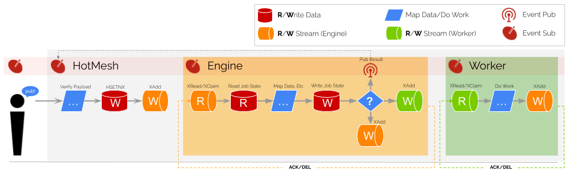

# HotMesh FAQ

## What is HotMesh?
HotMesh is a wrapper for Redis that exposes a higher level set of domain constructs like ‘activities’, ‘workflows’, 'jobs', etc. Behind the scenes, it uses *Redis Data* (Hash, ZSet, and List); *Redis Streams* (XReadGroup, XAdd, XLen); and *Redis Publish/Subscribe*. The ultimate goal is to resurface Redis as a *Reentrant Process Database*.

## What is a Reentrant Process Database?
Similar to how a relational database provides tools for modeling *tables* and  *relationships*, a process database provides tools for modeling *activities* and *transitions*. Constructs like "reading" and "writing" data still remain; however, instead of reading and writing to *tables*, the targets are *jobs* and *flows*. Importantly, the act of reading and writing data drives the perpetual behavior of the system, delivering process orchestration through the simple act of journaling state.

## Are there Advantages to a Reentrant Process Architecture?
A key component of Reentrant Processes is an understanding of retries, idempotency, and the ability to handle failures. HotMesh provides a simple, yet powerful, mechanism for handling retries and idempotency through the use of Redis Streams. If the execution fails, the engine will retry (xclaim) the activity until the retry limit is reached. If the job succeeds, the engine will transition to the next activity.

While idempotency is guaranteed for the engine, it is impossible to guarantee for workers (workers call your functions, and are only idempotent if your functions are idempotent). Regardless, it is possible to model these exceptions in HotMesh and design rollbacks in the YAML model. But if the workers being orchestrated are idempotent, then the entire process is idempotent and will inevitably conclude, backed by the reliability of stream semantics (xadd, xreadgroup, xdel, xack, xclaim, etc).

## Are there Examples of Other Reentrant Process Engines?
Yes! [Temporal](https://temporal.io) refers to the [pattern](https://en.wikipedia.org/wiki/Reentrancy_(computing)) in their technical docs. Technically speaking, HotMesh is a `Reentrant Process Engine` that runs `Reentrant Process Workflows`. But it's fundamentally different from Temporal in that the engine is an emergent property of the data journaling process. HotMesh can run millions of durable workflows using a single Redis instance using this approach.

## What gets installed?
HotMesh is a lightweight NPM package (250KB) that gets installed anywhere a connection to Redis is needed. Essentially you call higher-level methods provided by HotMesh (pub, sub, pubsub, etc) instead of the lower-level Redis commands (hset, xadd, zadd, etc).

## Is HotMesh an Orchestration Hub/Bus?
Yes and No. HotMesh was designed to deliver the functionality of an orchestration server but without the additional infrastructure demands of a traditional server. Only the outcome (process orchestration) exists. The server itself is an emergent property of the data journaling process.

## How does HotMesh operate without a central controller?
HotMesh is designed as a [distributed orchestration engine](./architecture.md) based upon the principles of CQRS. According to CQRS, *consumers* are instructed to read events from assigned topic queues while *producers* write to said queues. This division of labor is essential to the smooth running of the system. HotMesh leverages this principle to drive the perpetual behavior of engines and workers (along with other strategies described [here](./architecture.md)). 

As long as a topic queue has items, consumers will read exactly one and then journal the result to another queue. As long as all consumers (engines and workers) adhere to this principle, sophisticated workflows emerge. The "secret" to the process is to model the activity sequence using a DAG and then compile the DAG into singular, stateless events.

## What is the purpose of hotMesh.pub?
Call `pub` to kick off a workflow. It’s a one-way fire-and-forget call. The job id is returned but otherwise there is nothing to track.

## What is the purpose of hotMesh.sub?
Call `sub` to listen in on the outcome of any targeted topic. This is standard fan-out behavior that one would expect from a pub/sub implementation. Log events to DataDog, look for interesting values in the message stream, etc. This is a simple way to get event-driven insights into the running system and would be preferable to legacy approaches like long-polling where one would continually poll the system to get the latest job status(es).

## What is the purpose of hotMesh.pubsub?
Call `pubsub` from your legacy system to kick off a workflow and wait for the response. HotMesh is an in-memory orchestrator/router and effortlessly handles sophisticated, multi-dimensional, multi-system workflows but can also be used to call one microservice from another (like Node Fetch) at rates that are comparable to a standard ELB.

## Can you update a running deployment?
Yes, but you must make principled changes. If you update your model and delete everything, it will break. But if you want to add additional logic (like a new activity), it’s supported. Adding and updating logic is relatively straightforward, while deprecation is preferable to deletion.

The system is designed to [deploy new versions](./system_lifecycle.md#deploy-version) (the YAML execution rules) to Redis where they are held as the single source of truth. All running engines are then asked to join in a [game of ping pong](./system_lifecycle.md#activate-version). If every running engine in the quorum simultaneously says “pong” 4 times in a row, then the quorum is considered to be “healthy” and “unified” and capable of real-time upgrades. 

At this moment, a fifth and final message goes out, instructing all clients to stop using cached execution rules without first querying for the active version. All engines continue to run and use their cached execution rules, but they will always confirm the version to use with an extra real-time call to the server each time they process a message. 

Finally, the lead server in the quorum will update the active version, forcing all connected engines to formally cache the execution rules for this latest version target and cease making the extra version check with each call.
