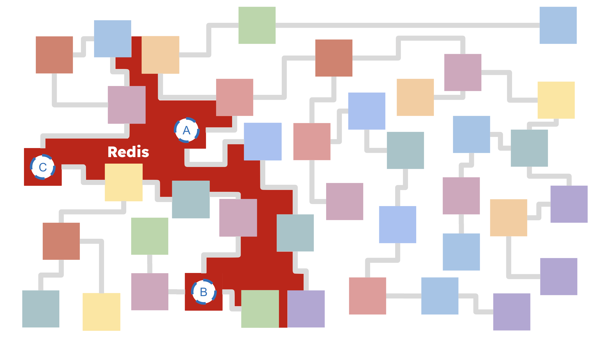

# Refactoring 101: Simplifying Microservice Workflows

Consider the following microservices network. It doesn't matter what the services do, or if it's AWS, GCP or Azure. We've all encountered systems like this and the burdensome *tech debt* they represent.


There's real value in there. Functions A, B, and C represent important company IP. But reasoning through a migration can be so challenging that often it's easier to just leave it alone or add another bandage.

### Enter Redis
As cluttered as the network might be, there's a common thread: **Redis**. If the legacy functions can access Redis, then Redis can access the legacy functions.



From this vantage point, networking doesn't change. The network remains chaotic. But now we have a strategy to simplify things and organize the functions as activities in a business process.


HotMesh steps in as a mediator, leveraging all 3 Redis communication channels (`streams`, `data`, and `events`) to reverse the information flow and orchestrate the activities. This inversion of control is a game-changer, simplifying refactoring by plucking and orchestrating target functions independent of the legacy network clutter.

## Time to Connect Endpoints
The approach is now clearer, allowing us to refactor without disrupting legacy processes.

### AI Design Assistance
An advantage of HotMesh's model-driven design system is that AI can help you reason through the process. Documentation and User Guides are helpful, but workflows can get complicated--especially when there's data mapping involved.


The AI-generated YAML configuration is now ready for deployment.

```yaml
app:
  id: sandbox
  version: '1'
  graphs:
    - subscribes: sandbox.test
      activities:
        t1:
          type: trigger
        a1:
          type: worker
          topic: sandbox.a
        a2:
          type: worker
          topic: sandbox.b
        a3:
          type: worker
          topic: sandbox.c
      transitions:
        t1:
          - to: a1
          - to: a2
          - to: a3
```

> For more detailed YAML configuration examples, including advanced data mapping, check out the [Quick Start](./quickstart.md).

## Getting It All Running
Setup and usage commands are straightforward, detailed in the [Quick Start](./quickstart.md). AI can assist here too.


Once the workflow is deployed and active, initiating a new execution is as simple as publishing a message to `sandbox.test`. The Job ID returned from the publish command can be used to monitor the execution and any associated telemetry data.

```javascript
const jobId = await hotMesh.pub('sandbox.test', {});
```

## Wrapping Up
By leveraging Redis, we've significantly simplified our microservices network without causing disruptions. The network can now be viewed as a series of activities, facilitating changes without breaking the legacy process.

Each function orchestrated by HotMesh runs with Queue semantics (via Redis Streams), ensuring messages are only deleted post successful function execution. Additionally, every activity orchestrated by HotMesh [exports detailed telemetry data](./system_lifecycle.md#telemetry) to your chosen backend system. Set up alarms and alerts to stay in the loop about any issues and take control of your business processes.

**HoneyComb Trace UI**


