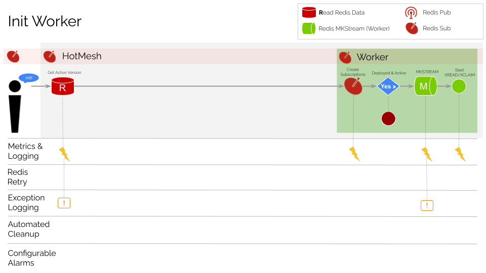
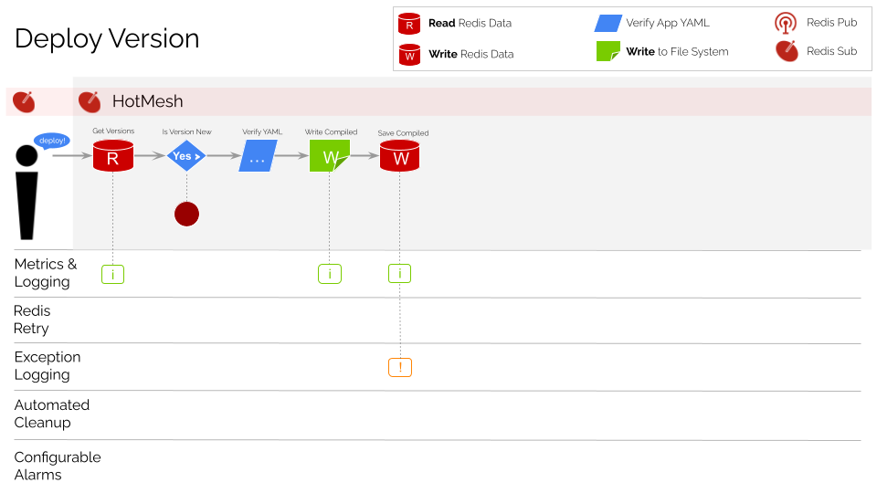
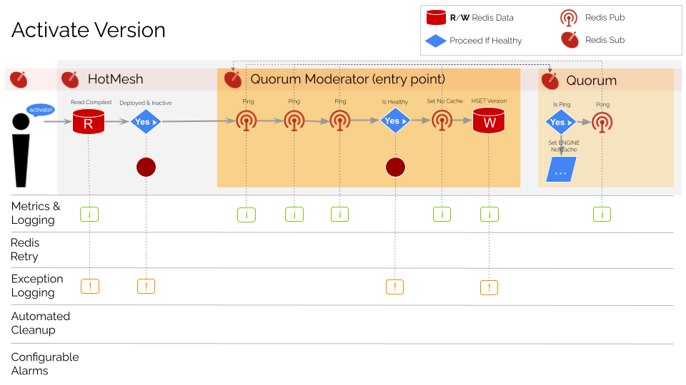
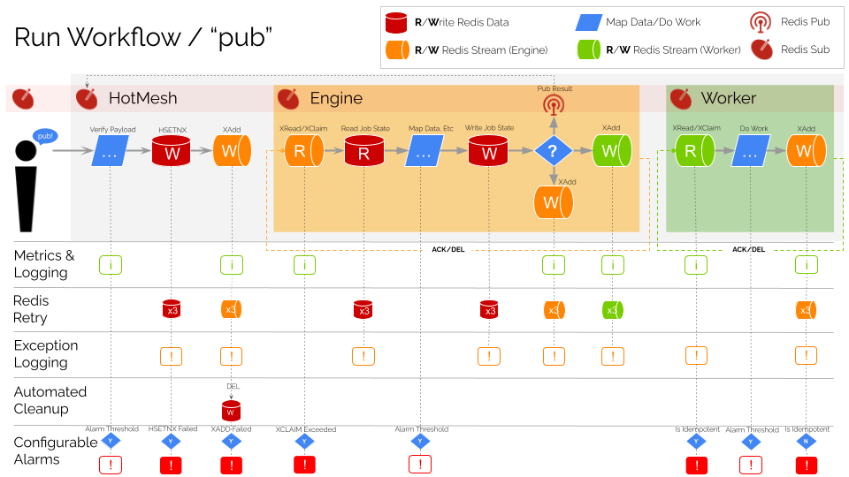

# System Lifecycle Guide

This README provides an overview of the `HotMesh` runtime engine from the perspective of the system lifecycle. The lifecycle is comprised of the following steps:

## Table of Contents
1. [Init Engine & Quorum](#init-engine-and-quorum)
2. [Init Worker](#init-worker)
3. [Deploy Version](#deploy-version)
4. [Activate Version](#activate-version)
5. [Run Workflow](#run-workflow)
6. [Telemetry](#telemetry)

## Init Engine and Quorum
The engine is the core of the HotMesh system and is responsible for running activities according to the YAML execution rules. Every *engine* instance is initialized with a corresponding *quorum* instance which coordinates its activity with all other engines in the network.

```javascript
import Redis from 'ioredis';
import { HotMesh } from '@hotmeshio/hotmesh';

//start the engine
const hotMesh = await HotMesh.init({
  appId: 'myapp',
  engine: {
    redis: {
      class: Redis,
      options: { host, port, password, db }
    }
  }
});
```

The engine startup process begins with a call to Redis (`HGET`) to get the active app version. The engine and the quorum then subscribe to relevant topics. The third Redis channel (streams) is only enabled if an *active app version* is returned from `HGET`.


## Init Worker
Workers are initialized similarly to the engine, using the same call to `init`. Each worker is initialized with a `topic`, `store`, `stream`, `sub`, and `callback` function. The `topic` is the name of the event that the callback function is subscribed to, serving as a link between the YAML rules and the execution runtime.

```javascript
import Redis from 'ioredis';
import { HotMesh } from '@hotmeshio/hotmesh';

const hotMesh = await HotMesh.init({
  appId: 'myapp',
  workers: [{
    topic: 'discounts.enumerate',
    redis: {
      class: Redis,
      options: { host, port, password, db }
    }
    callback: async (data: StreamData) => { … }
  }]
});
```

The worker initialization process begins with a call to Redis (`HGET`) to get the active app version and subscribe to worker events. The third Redis channel (streams) is only enabled if an *active app version* is returned from `HGET`.



## Deploy Version
When the app YAML file is ready, the `deploy` function can be called. This function is responsible for merging all referenced YAML source files and writing the JSON output to the file system and to Redis. It is also possible to embed the YAML in-line as a string as shown here.

>*The version will not be active until activation is explicitly called.*

```javascript
const yaml = `app:
  id: sandbox
  version: '1'
  graphs:
    - subscribes: sandbox.work.do
      publishes: sandbox.work.done

      activities:
        gateway:
          type: trigger
        servicec:
          type: worker
          topic: sandbox.work.do.servicec
        ...

      transitions:
        gateway:
          - to: servicec`;
const deploymentStatus = await hotMesh.deploy(yaml);
//returns true|false
```

The following illustrates the app version *deployment* process.



## Activate Version
Once the app YAML file is deployed to Redis, the `activate` function can be called to enable it for the entire quorum at the same moment. The approach is to establish the coordinated health of the system through series of call/response exchanges. Once it is established that the quorum is healthy, the quorum is instructed to run their engine in 'no-cache' mode, ensuring that the Redis backend is consulted for the active app version each time a call is processed. This ensures that all engines are running the same version of the app, switching over at the same moment and then enabling 'cache' mode to improve performance.

```javascript
const activationStatus = await hotMesh.activate('1');
//returns true|false
```

The following illustrates the app version *activation* process.



## Run Workflow
Once the app is active, it's possible to send events and kick off workflows by publishing to known topics. Call `pub` to start a workflow.

```javascript
const topic = 'discount.requested';
const payload = { id: 'ord123', price: 55.99 };
const jobId = await hotMesh.pub(topic, payload);
//`jobId` will be `ord123`
```
Call `pubsub` to await the workflow response (like a typical fetch call).

```javascript
const topic = 'discount.requested';
const payload = { id: 'ord123', price: 55.99 };
const jobOutput: JobOutput = await hotMesh.pubsub(topic, payload);
//`jobOutput.data.discount` is `5.00`
```
The following infographic illustrates the mechanics of the system and how the distributed engine and workers are able to produce complex outcomes using journaling and CQRS principles. Each time a *worker* or *engine* pulls an item from its assigned Redis Stream, it concludes by writing the outcome to another stream. This simple mechanism of reading from one stream and writing to another is the basis for the entire system and how complex workflows are achieved. Every complex workflow is simply a series of singular activities implicitly stitched together by writing to streams in a sequence.



## Telemetry
HotMesh includes instrumentation for [Open Telemetry](https://opentelemetry.io/). The HotMesh service name will appear in the telemetry output as `@hotmeshio/hotmesh` and will include details about the activities in the running flow, including their sequence and relationships.

### Upstream Continuity
It is possible to pass `trace` and `span` IDs from your existing telemetry implementation to the `pub` and `pubsub` method calls to provide trace continuity with your legacy systems.

```javascript
const topic = 'discount.requested';
const payload = { id: 'ord123', price: 55.99 };
const context = { metadata: { trc: '123456', spn: '001' }};
const jobId = await hotMesh.pub(topic, payload, context);
```

### Downstream Continuity
HotMesh emits the `trace` (trc) and `span` (spn) IDs to registered worker functions. Add telemetry logging to your worker functions for a full, system-wide view of the running workflow as a connected graph of activities.

### Custom Telemetry Logging
Activities defined in the YAML execution models can export custom telemetry attributes. This is useful when logging specific values for which you have added alarms or conditions in the telemetry backend.

Add a `telemetry` property to an activity and all subordinated properties will be emitted to the telemetry backend if they are of type `boolean`, `string`, or `number`. For example, the following YAML will emit an `approved` property to the telemetry backend that is always `true` when activity `a3` is run.

```yaml
activities:
  ...

  a3:
    title: Return Approved
    type: hook
    telemetry:
      approved: true
```

Use [`@pipes`](./data_mapping.md) to customize telemetry output. The following declaration will emit an `app.activity.data.approved` attribute that is `yes` or `no`, depending upon the boolean state of `a2.output.data.approved`.

```yaml
activities:
  ...

  a3:
    title: Return Approved
    type: hook
    telemetry:
      approved:
        "@pipe":
          - ['{a2.output.data.approved}', 'yes', 'no']
          - ['{@conditional.ternary}']
```

### Dashboards and Alerts
HotMesh tracks telemetry *spans* and *traces*, emitting them to the telemetry backend as a set of nested activities that naturally reform into the original workflow graph. Meter critical activities with alarms, alerts, and custom dashboards.

In the following dashboard (HoneyComb), the fully composed execution graph can be seen for the job, including the subordinated job that is called. The columns `js` and `jss`, represent **job state** and **secondary job state** respectively. These are emitted by the HotMesh engine and can be used to track the progress of job activities as they execute in parallel.

>The HotMesh YAML execution models depicted in the following graph are located [here](../tests/$setup/apps/calc/v1/). Take note of how the YAML models (the DAGs) are surfaced in the telemetry dashboard as a connected graph of activities.

The *FANIN* and *FANOUT* designations represent locations in the exection flow where information is exchanged via streams. *FANOUT* designates the invocation, while *FANIN* designates the stream response in the duplexed exchange.

**HoneyComb Trace UI**


>HotMesh's duplex communication pattern can be seen in the trace output, with legs 1 and 2 of each activity described in the logs.
